# **AI in Blueprints:**
{: .no_toc}

## Table of Contents
{: .no_toc .text-delta }

1. TOC
{:toc}
---
## Blackboard variables in Blueprints

### <ins>Get/Set Blackboard Keys in BP</ins>: 
You can get/set an AI’s blackboard key in a blueprint.
* Key Name, even though is a ``name`` variable in the blueprint, means the actual name of the blackboard key you are trying to find. If you want to find a certain key, you’d have to look at the blackboard, and find out what type of variable the key is.  
* Don’t use a ``blackboard key`` variable type in a regular blueprint.  

  Get `target actor` example
  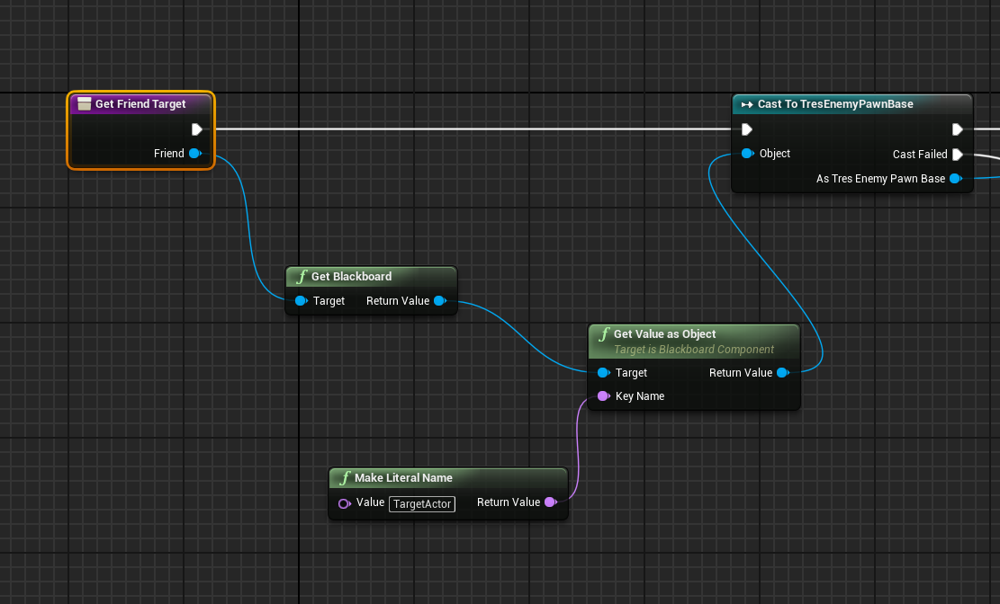

  Set `target actor` example
  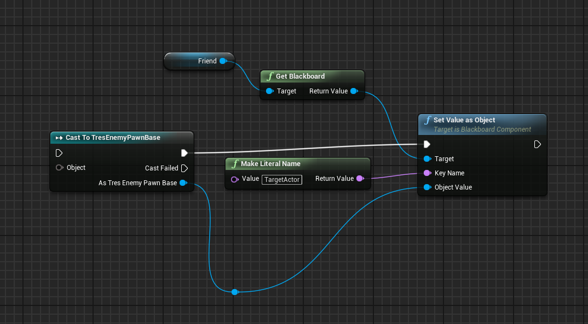

---

## Behavior Tree Blueprints - Custom BT nodes

> [!CAUTION]
> When making a custom BT node, you must use ``BTService_blueprintbase`` as the parent class. Do not use the regular BTService as your parent class. This goes for task/decorators as well.

### <ins>BTService\_BlueprintBase</ins>: 
This is how you make custom bt nodes using blueprints to run in your behavior tree, which allows you to execute logic and pass variables through the blackboard.Make sure when making a blueprint for a bt service you use the ``BTService_blueprintbase`` class, do not use the regular BT\_Service class (this is only for C++). You can create a blueprint service to run in a Behavior Tree.
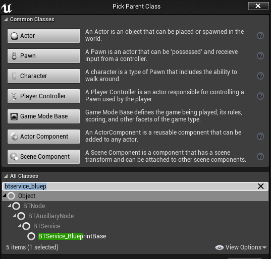 

* You can create a service to check on intervals, update blackboards, or update other things in the world, or report debug easily.  
* Use Event Receive Tick (for each tick) and event receive activation (when the bt first gets to it)  
* Event receive deactivation is when the bt leaves that branch
  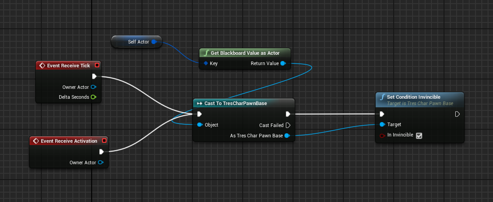  
* Get blackboard key values like the example shows: This is where you use a ``blackboard key`` variable. Mark it instance editable so that the variable appears in the node on the behavior tree. On the behavior tree, after build, you will be able to set which key gets passed into the variable.  
  * *Note: Owner actor doesn’t work in kh3 for whatever reason, so you have to pass in selfActor through the bt/bb*  
* You can also set other variables to be exposed and set through a behavior tree.
  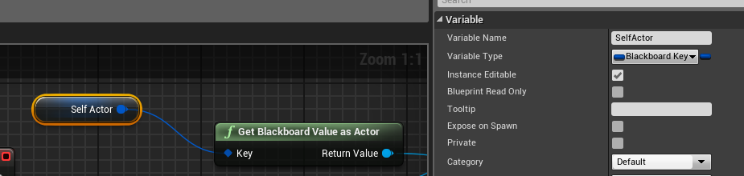
  
* This is how it shows up in the BT:
  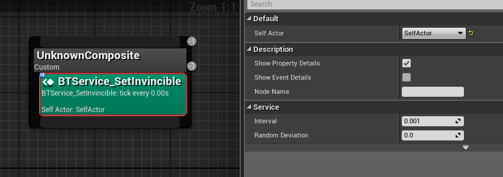

### <ins>BTTask\_BlueprintBase</ins>:  
This is how you make custom bt nodes using blueprints to run in your behavior tree, which allows you to execute logic and pass variables through the blackboard. Make sure when making a blueprint for a bt task you use the ``BTTask_blueprintbase`` class, do not use the regular BT\_Task class (this is only for C++). You can create a blueprint task to run in a Behavior Tree. You’d usually use this to run background logic or set blackboard keys.

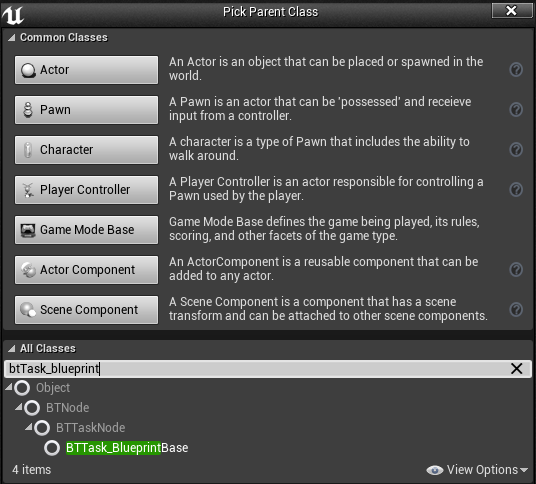

* Use event receive and finish execute to finish it properly, you must have finish execute. This allows you to set success/fail conditions for the BT to know if the task succeeded  
* In the example below, “ActorClass” is a public variable, allowing me to set the class from the BT to whatever I need
  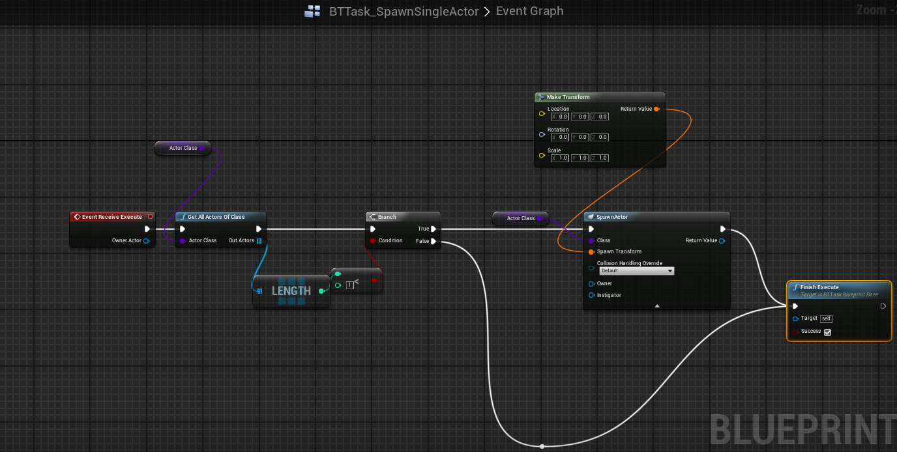

### <ins>BTDecorator\_BlueprintBase</ins>: 
Make sure when making a blueprint for a bt decorator you use the ``BTDecorator_blueprintbase`` class, do not use the regular BT\_Decorator class (this is only for C++). You can create a blueprint decorator to run in a Behavior Tree.

* I honestly find it extremely rare to have to make a custom decorator. Square really went wild with making a ton of C++ decorators. Thus, I have not experimented in depth with every function or how exactly aborts and flow functions work.  
* Example below of checking if a specific ability is equipped
  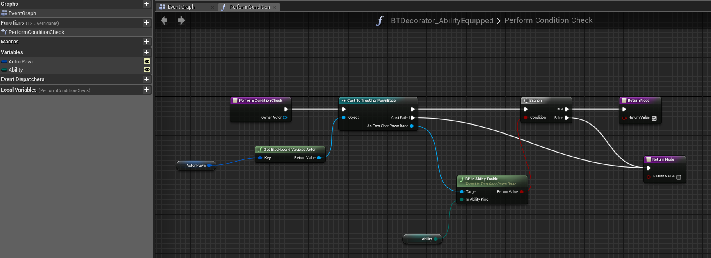
---

## EQS Blueprints

### <ins>Blueprint Contexts: 
You can create your own contexts through blueprints. While you can’t create tests directly, this does allow you to “cheat” in your own tests through standard blueprint logic and start with a generated context that fulfills your tests. You need to override the single actor or multiple actors (or location/locations) function in order to use it properly. Example: This context gets all actors of class tresProjectileBase. You could extend it to only get projectiles with a team id on the enemy team.
* Just like with custom blueprint BT nodes, make sure you use ``EnvQueryContext_BlueprintBase`` as the parent class.
  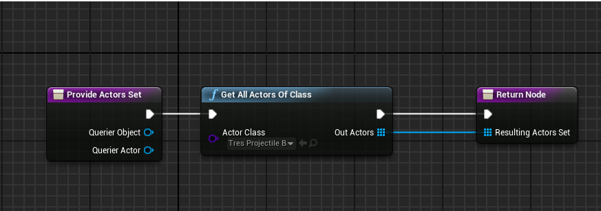

### <ins>Running an EQS inside a BP: 
If you want to run an eqs inside a BP for whatever reason, you may do so. You could use this to check for certain conditions in a manager, for example.
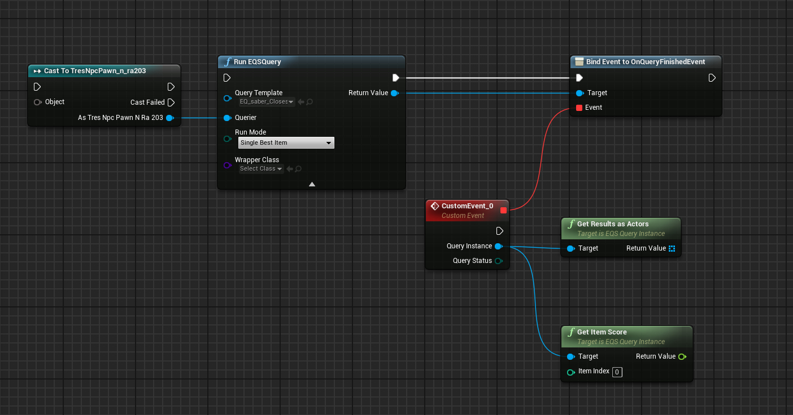

### <ins>EQS Testing Pawn: 
Allows you to test in engine visually like I have been doing in the screenshots in the EQS. Unfortunately, this only lets you test the base ue tests and generators, as the gameplay debugger was stripped from tres on ship. You can still get a good idea though if you are confused. To use, create an eqs test pawn, then drop it in a level. Set the test eqs as your eqs, and you should be good to go. Simply click on the pawn in the level editor to make the bubbles appear. Change the tests or move around the pawn to redo the results.use.
