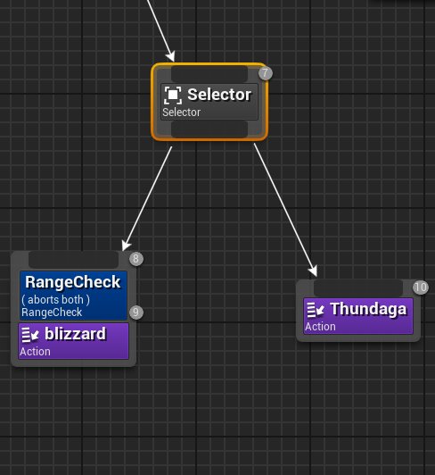
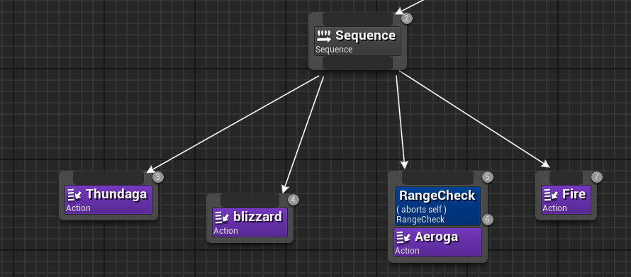
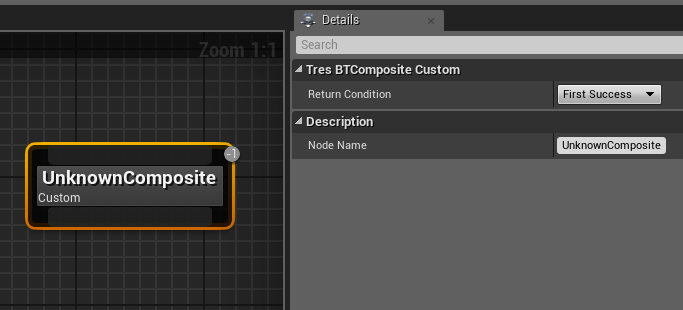

# **BT Composites**
{: .no_toc}

## Table of Contents
{: .no_toc .text-delta }

1. TOC
{:toc}
---
## <ins>Selector</ins>: 
Finds the first child that succeeds. If that child succeeds, then the selector keeps running that child again. It will keep running that child until it fails. If that first child fails, it tries the next child. If that child succeeds, then it trieds the first child again, then the second. If both fail, then the selector is considered a fail, and it moves on. Generally, success means passing decorators, but you can set blueprint tasks to succeed or fail.

Example: This selector will keep selecting blizzard over and over again until it fails the range check. Then it will select Thundaga until the range check passes again.

## <ins>Sequence</ins>: 
Runs each child in a row. If a child fails, then the sequence fails and stops at that child and does not attempt to run the rest of the child. Example: child 1 fails, child 2 is not attempted.

Example: This sequence will fire Thundaga, then Blizzard, then get to Aeroga. However, let's assume it does not pass the Range Check. Instead of casting Aeroga, the sequence stops there. Aeroga is not cast, nor will Firaga be cast after it. Instead, the sequence is considered a failure and the BT will move onto another branch.

## <ins>Parallel</ins>: 
Run a purple task node (usually a state) alongside other logic. Using parallels is generally not considered good bt design. However, because we are limited by states in KH3, you might need to use these to spawn logic or management actors (but you could also spawn those or run logic in anim notifies).  
## <ins>Custom Composite (Tres “unknown composite”)</ins>: 
Gives you 3 options, ``first success``, ``first failure``, and ``last node completes``. First success is a selector (who know why they felt the need to remake these). It runs till it finds the first success, and then runs it again. First failure means it runs each node left to right until it fails, which then returns fail. 	  
>[!IMPORTANT]
>``Last node completes`` is what makes this composite special. “Last node completes” runs each node left to right, regardless of if any of the children fail. If child 1 and 2 fail, child 3 will still be attempted. This is called an **unconditional sequence**.

  

## <ins>Random</ins>: 
Chooses a child at random. You can assign the probabilities using weights. I believe the weights are ratios, so you could use .33 .33 .33 or 1 1 1 for even distribution of children ((I’m 80% sure it filters out failing children automatically, but I could be wrong)). 
