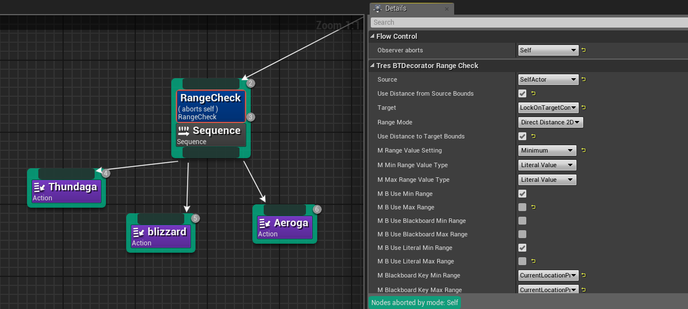
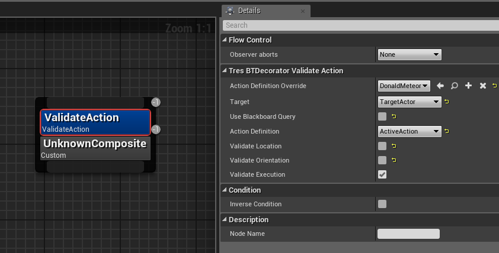
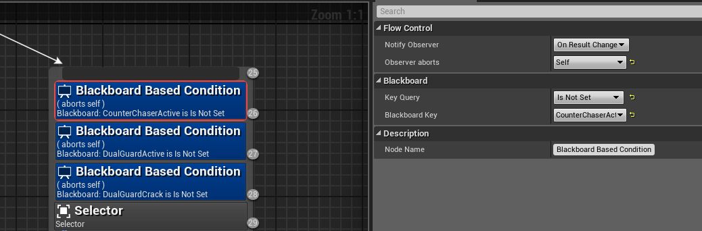

# **BT Decorators**
{: .no_toc}

## Table of Contents
{: .no_toc .text-delta }

1. TOC
{:toc}
---

>[!TIP]
>Don't forget to use [observers](./BehaviorTree.html#decorator-observers)

## <ins>Range check</ins>: 
Runs check on range between two actors, components, vectors, or combination between the two. Pass/fail based on conditions
    
  * Source: bb key (such as selfactor)  
  * Target: bb key (such as targetactor)  
  * Use distance/source bounds: I generally leave this checked, though I am not sure what it does exactly.  
  * RangeMode: 2d, 3d, Z (up/down only)  
  * Range Value Setting: Min Max Range, Minimum is atleast x amount away or farther \= true. Maximum is x amount away or less \= true.  
  * You can use numbers or blackboard keys for the test  
  * Example: This checks that the target/lockoncomp of the target is at minimum 500 units away or more. If so, proceed and use thundaga. If the lock on comp comes closer to selfactor than 500 units, abort that task/stop trying to run it.
      

## <ins>Validate Action</ins>: 
Validates that the state can be executed before attempting to run the state. You can check “execution” (which includes ability equipped and mp for npcs), location (range set in the state), orientation (angle/rotation params set in the state).  
  * Action Definition Override: put the state here  
  * Use blackboard definition: only if you want to use a state “class” to check from a blackboard key instead of a set state. You most likely will not ever need this
    
* <ins>Tres State check</ins>: Checks if the pawn’s state enum matches atleast one of the state enum you list. The blackboard key lets you test target actor, self actor, or any other pawn actor.  
* <ins>Cooldown/TagCooldown</ins>: Allows you to set cooldowns for those branches after they’re executed. Using tagcooldown alongside “settagcooldown” allows you to use tags so that multiple branches can be put on cooldown from one tag.  
## <ins>Loop</ins>: 
forces multiple executions of a node (useful in sequences) unless it’s aborted  
## <ins>Tres State Check</ins>: 
Checks the state of whatever ``actor`` blackboard key you supply it. 
## <ins>Blackboard Decorator</ins>: 
Allows you to pick a blackboard key and check against it. Observers make these powerful, as you can set blackboards easily through blueprints, allowing you to extend and control your behavior trees through anim notifies, managers, level scripts, or anything else blueprint related.  
  * For bools, is true or false?   
  * For int, is int greater/less than or \= to number?  
  * Does string \= str'?  
  * Is actor bb key valid? (key is still filled or actor in key still exists?)
  

