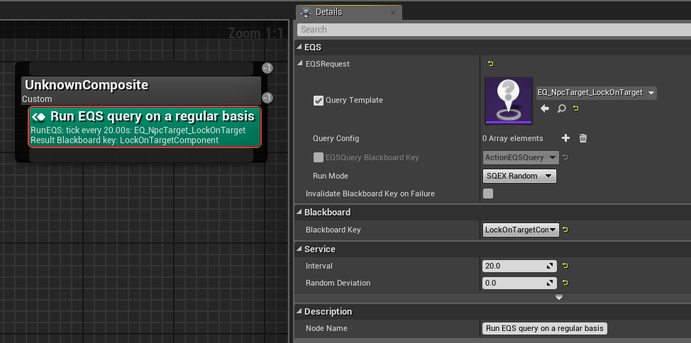
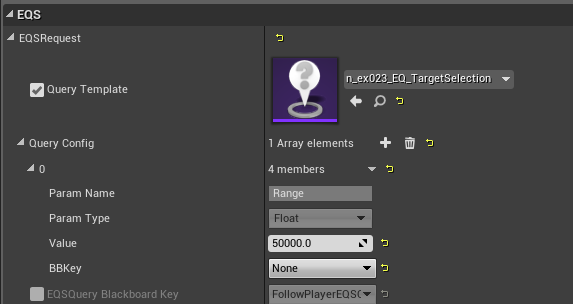
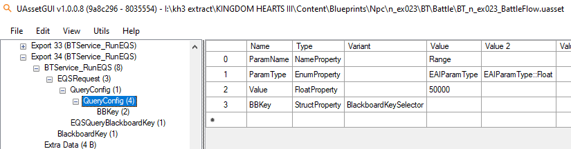
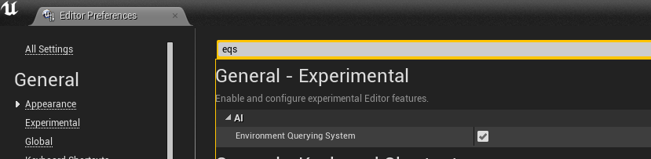
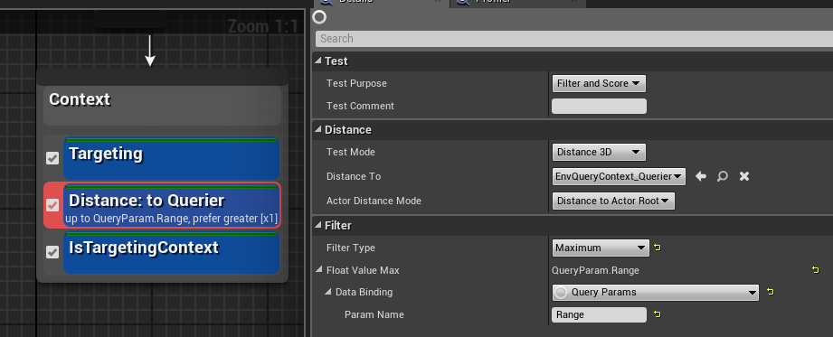

# **BT Services**
{: .no_toc}

## Table of Contents
{: .no_toc .text-delta }

1. TOC
{:toc}
---
## <ins>Run EQS Query</ins>: 
This is generally what you will be using mostly when it comes to services. Runs an environmental query, which scans for locations or targets.
  >[!CAUTION]
  >You must dummy your EQS correctly in order to have configs show up. If you do not, your eqs will not run, and your BT will probably not run. Read below for instructions on dummying EQS correctly.

  
    
  * EQS Query: Which eqs will you run  

    * Configs: The eq configs allow you to pass in your own parameters into an environmental query. If you want to learn more, look at the EQS guide, but for BT, you must make sure it matches what an EQS example looks like from a Square Enix made node. <ins>If you dummy the EQS correctly, they should automatically populate the environment configs</ins>.
      
        
  
    * Use UAssetGui to find what an EQS config should look like in a BT. You can also attempt to backwards import an EQS. See C-Paz’s guide on backwards importing eqs. (Some EQS break the editor).
        
    * To dummy the EQS properly if you cannot backwards import, make any generator, add any test, and add the correct “AI data label” types, with the matching name. See example below on the EQS side. *Note: To make EQS, you have to enable EQS in the editor preferences*

      
      

    * Some EQS can be backwards imported from cooked into the editor. C-Paz has a guide on this. Many of them unfortunately crash the editor, however.  
  * Blackboard Key: Which bb key to fill? NOTE: You must choose a key that matches the EQS. ie if its an eqs that returns an actor, use an actor key. If it returns a vector, use a vector key.  
  * EQS Query Bb Key: Tou could use bb keys to dynamically set eqs to be run, but I have never seen them actually use this, nor have I ever needed to use this.  
  * Invalidate Key: If the EQS fails to return anything, should the key also be cleared?  
  * Service Interval: How often to run this service 
 
## <ins>Gameplay Focus</ins>: 
This makes the pawn running the BT “focus” on whichever actor bbkey you place. This purely means they pretty much look at them/turns their head towards the actor, even if running or walking sideways.