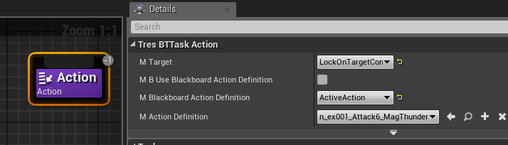
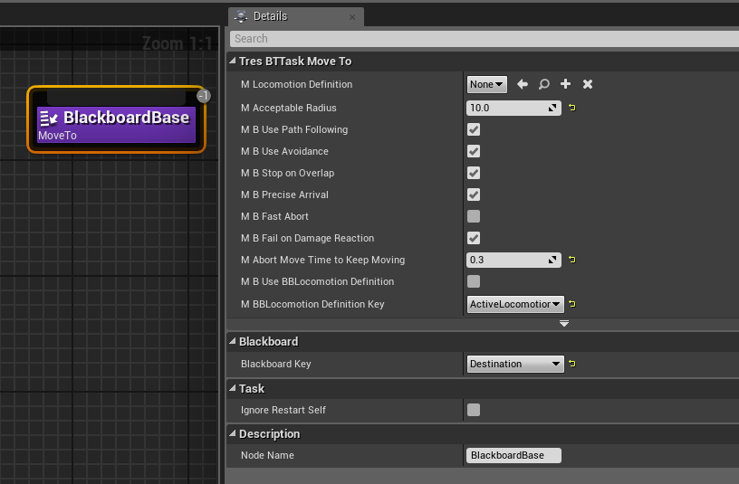
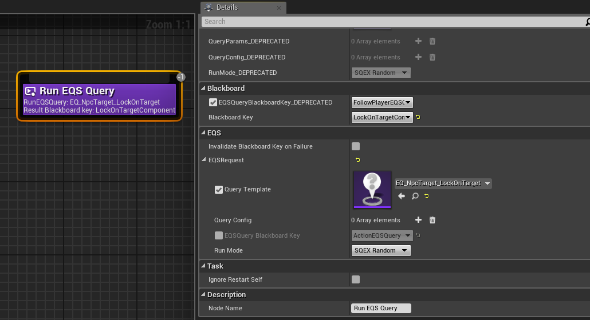
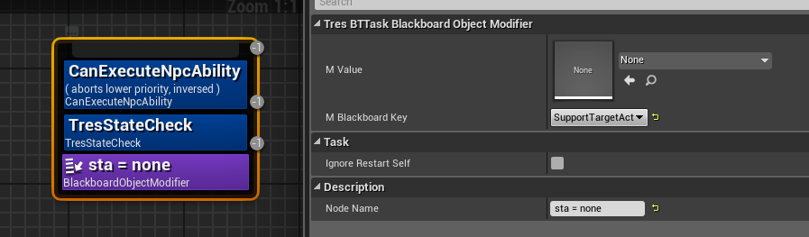

# **BT Tasks**
{: .no_toc}

## Table of Contents
{: .no_toc .text-delta }

1. TOC
{:toc}
---
## <ins>UE nodes</ins>: 
You generally won’t use the ue base nodes (except for run behavior).  
## <ins>TaskAction (Tres)</ins>: 
Lets you set a state. You can also set a target actor.
  

## <ins>TaskMoveTo (Tres)</ins>: 
Moves the pawn to the location. You can use any actor, comp, or vector.

  * Locomotion Defintion: allows you to use a different move state than the one set as the default in the pawn. Leave it as none to use the default set in the pawn.  
  * Use avoidance: Tries to avoid other actors while moving around  
  * Use path following: Uses navmesh to get to its destination. If you leave this unchecked, then it might get stuck on a wall it has to navigate around.  
  * Precise Arrival: Allows greater range for arrival rather directly on point.  
  * Abort time to keep moving: I’m not 100% sure what this does, but I think it allows the pawn to update its destination without using another move to task or quickly stopping, ie it keeps moving towards new destinations.  
  * Blackboard/Blackboard Key (the farthest down bb key): This is the most important, the destination. Can be a vector, an actor, or a component  
  

## <ins>Run Behavior</ins>: 
runs a behavior tree  

## <ins>RunEQS</ins>: 
Runs an environmental query
>[!NOTE]
>Usually you’d rather use a ``service`` than a task node for this, please view [BTServices](./BTServices.md) for ``RunEQSQuery``  
  * Note: don’t bother with the depreciation nodes, you can leave them default  
  * EQS Query: Which eqs will you run  
  * Result: Which bb key to fill? NOTE: You must choose a key that matches the EQS. ie if its an eqs that returns an actor, use an ``actor`` blackboard key. If it returns a vector, use a ``vector`` key.  
  * ActionEQS: You could use bb keys to dynamically set eqs to be run, but I have never seen them actually use this, nor I have used this.  
  

## <ins>BlackboardObjectModifier (and other BBxModifiers)</ins>: 
modifies the blackboard key to what you want or need, such as setting an int key to what you need, or adding or subtracting from it
  

## <ins>Wait</ins>: 
Makes the AI wait/idle for a set time (You can abort this easily as almost every state can abort idle)