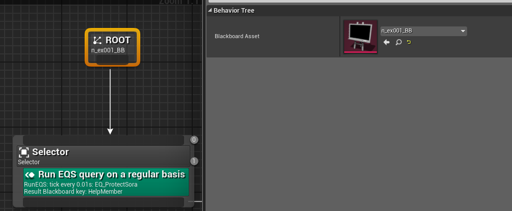
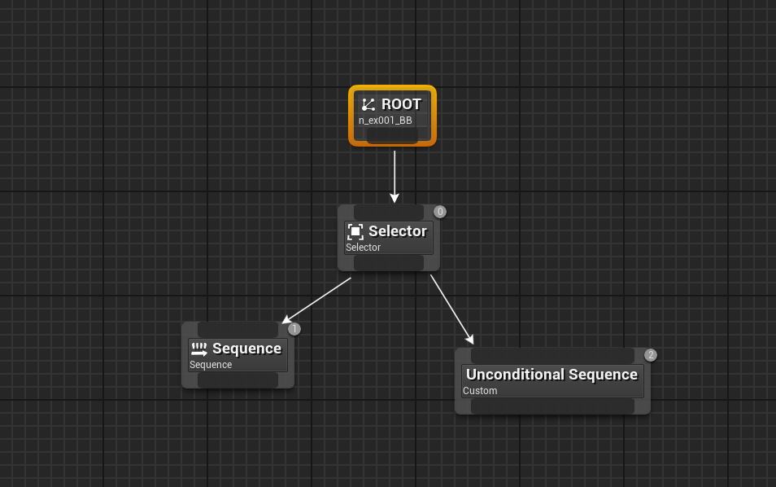
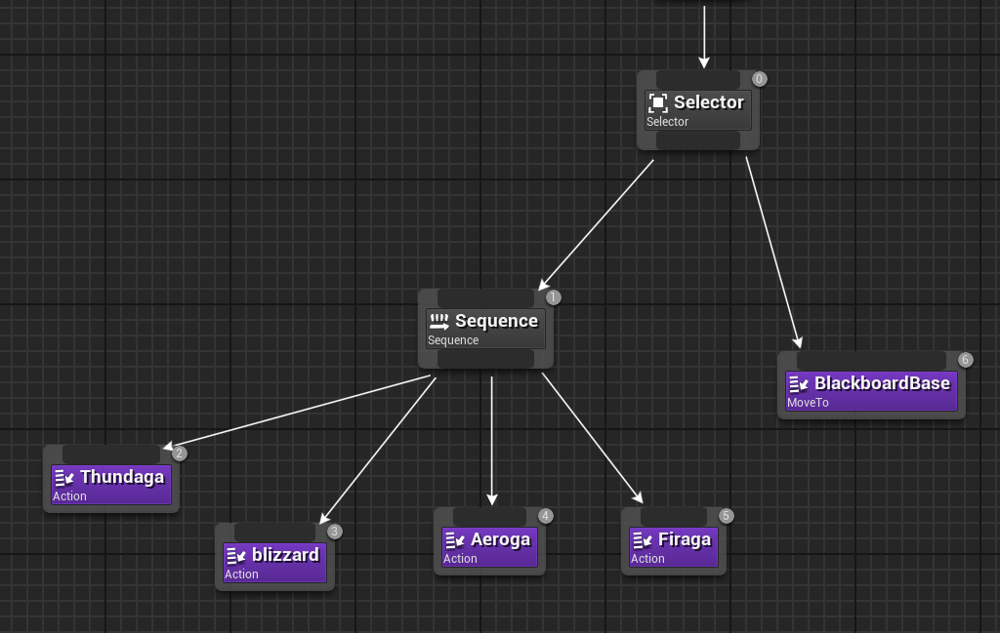
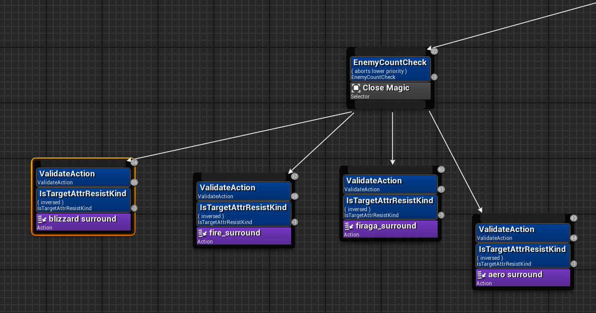
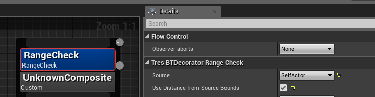
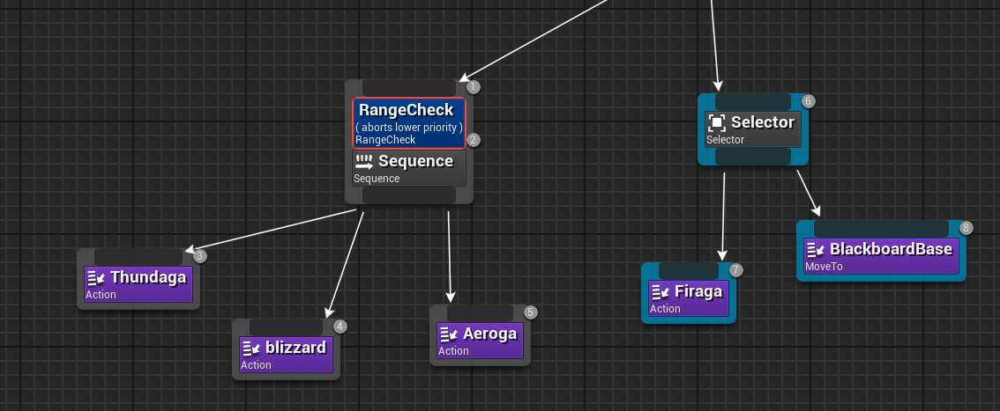
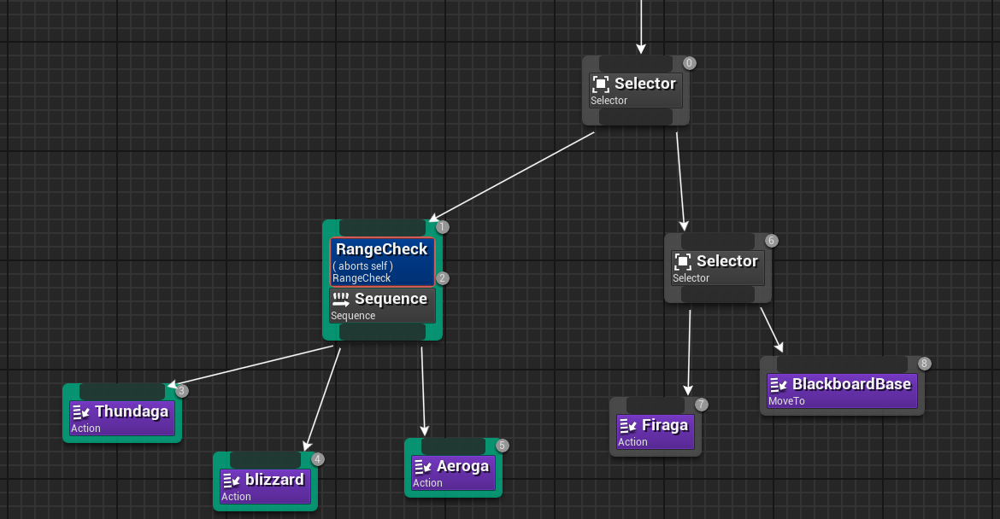
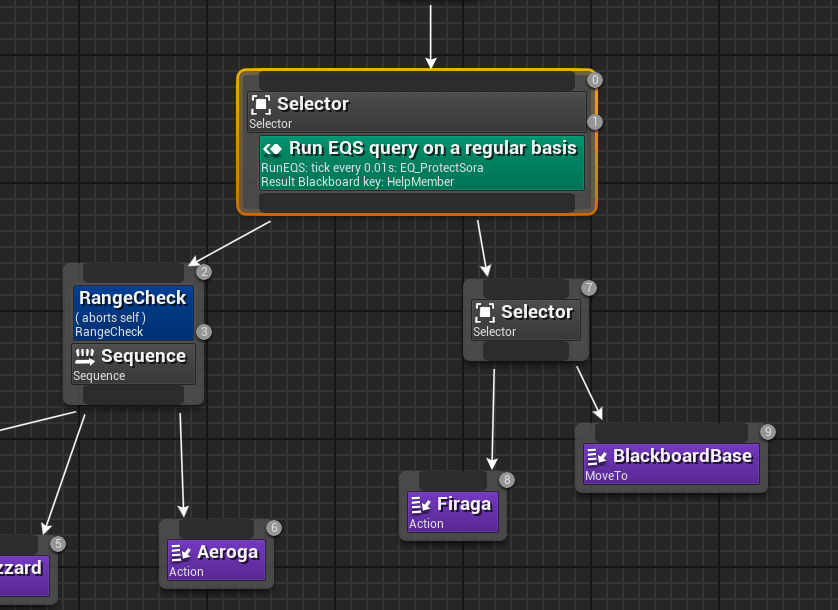

# **Behavior Tree Guide**
{: .no_toc}

## Table of Contents
{: .no_toc .text-delta }

1. TOC
{:toc}
---
## BT Overview

Behavior Trees run the AI decision-making. They look like a tree and flow top to bottom, then left to right. 

## <ins>Root</ins>: 
**A [Blackboard](./Blackboards.md) must be assigned. See blackboard section for more information.**
  

## <ins>[Composite Nodes](./BTComposites.md)</ins>: 
The grey nodes. You have to start with one. They control how a behavior tree flows. Should the behavior tree keep executing the same node, or should it execute left to right immediately?

## <ins>[Tasks](./BTTasks.md)</ins>: 
The purple nodes. These are generally states, but these are where each branch/leaf “ends”. Usually with a tresBTtaskAction node, which lets you set a state. Could also be a move to node, or a BTTask node you develop yourself (which is a task made out of a blueprint).

## <ins>[Decorators](./BTDecorator.md)</ins>: 
Blue nodes. These nodes sit ontop of composites and tasks. These are gates for whether or not the tree should continue at that point. If they fail a decorator, then the tree starts flowing to another branch. They also include observers, which are very powerful. The decorators can abort other branches if the condition that was previously failed turns true. For example, a decorator can check the range from selfactor to targetactor.

## <ins>Decorator Observers</ins>: 
A setting on every decorator that allows you to “abort” other tasks or branches
>[!IMPORTANT]
>These are very powerful and what make decorators much more than simple if/then gates. 

  * ``None``: No aborts, decorator simply acts as a gate  
  * ``Lower Priority``: If the conditions for this decorator become true, then abort whatever task/branch is running to the right of it, and snap it back to the left to this branch. (Highlighted nodes in blue can be aborted, sometimes highlights don’t show up)
      
  
  * ``Self``: If the conditions for this decorator become false, then abort this branch and mark it as failed (and any children up to this decorator), meaning the tree will move on. (highlighted nodes in green can be aborted, sometimes highlights don’t show up)
    

  * ``Both``: Observes for both lower priority and self.

>[!NOTE]
>You cannot generally abort states unless you allow the state to be aborted by another type of state; more on that in state section.

## <ins>[Services](./BTServices.md)</ins>: 
Green nodes. These also sit ontop of other nodes. They allow you to easily fill or change blackboard keys through ticks at set intervals. For example, you can run an eqs to determine the targetactor.
  

## Custom Behavior Tree Nodes:

[Custom BT nodes made out of Blueprints](AIBlueprints.md#behavior-tree-blueprints---custom-bt-nodes)

Link above leads to the section explaining how to make custom behavior tree nodes (services, decorators, tasks) using blueprints.
