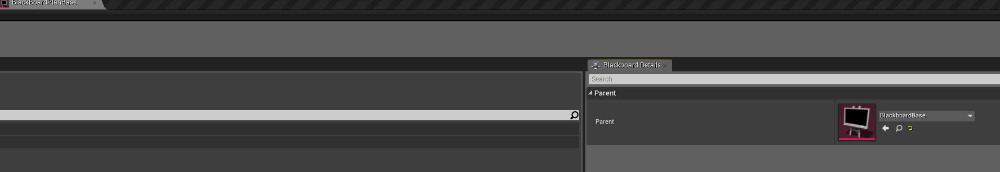
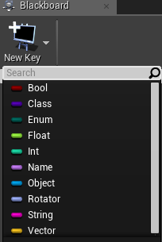

[Back to index](../index.md)

[Back to AI Overview](AIOverview.md)

# Blackboards

A blackboard is a container for a bunch of variables related to the blackboard’s owner actor. Each actor gets its own instance of a blackboard. Behavior Trees are assigned a blackboard from the very start as its root. This allows you to pass variables and information between pawns, behavior trees, environmental query systems, and blueprints. Generally, setting blackboard values will allow you to create powerful behavior trees. You technically could make a Behavior Tree without a blackboard, but that would be a very simplistic behavior tree and definitely would not meet the needs for battle AI in KH. Luckily for our purposes of modding, the dev team already has base blackboards with defined variables.

* Backwards importing cooked blackboards: Make sure you do them “in order”. Both the npc and the enemy blackboards are built off of a blackboard base. I’m pretty sure every boss is also built off of the enemy blackboard, meaning if you want to backwards import a boss or enemy’s BT, you <ins>**must**</ins> backwards import each preceding parent blackboard, the blackboard titled “blackboardbase”, then BlackboardPlanBase, then the boss blackboard, for example. If you have never backwards imported assets before, you <ins>**must duplicate**</ins> the asset when importing, delete the original, then rename the dupe to the original name. If you do not, you will not be able to edit them, and they will cook incorrectly. You must do this for every cooked asset you import, one at a time. See [C-Paz’s guide](../AI.md) for more info on backwards importing AI assets.

* Blackboard Keys \= variables. The blackboard keys can be floats, enums, vectors, rotations, bools, actors, components, class, or anything else you like.  

    

## Blackboard variables in Blueprints

[Blackboard and Blueprints](AIBlueprints.md#Blackboard-variables-in-Blueprints)

Press the link above for info on getting/setting blackboard keys from a blueprint.

# Specific Node Documentation

-[Blackboard](Blackboards.md)  
-[Behavior Tree](BehaviorTree.md)  
-[States](States.md)  
-[Blueprint Nodes](AIBlueprints.md)  
-[Environmental Query System](EQS.md)