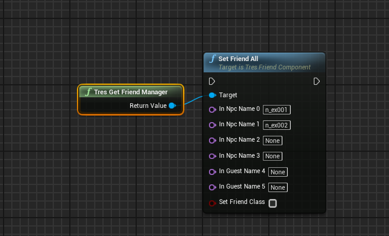
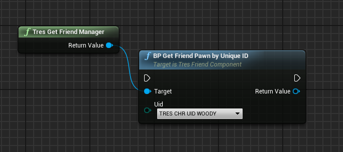
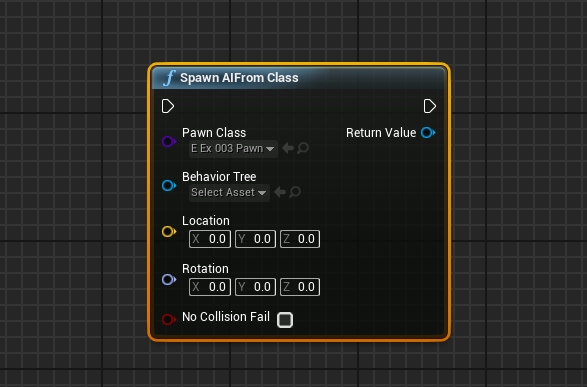

---

# Tres Game Pawns

{: .no_toc}

[//]: # [Back to index](index.md)

## Table of Contents
{: .no_toc .text-delta }

1. TOC
{:toc}

---

# NPCs

For AI to work on custom maps, a Nav Mesh Bounds Volume needs to be added.

## Set Friend All (Party members)

This is generally how you need to "spawn" party members.

Given the ["Friend manager"](./TresGameBlueprintLibrary/Friend%20Management/friendman.html#friend-management) and a pawn ID (See the [OpenKh documentation](https://openkh.dev/kh3/pawns.html)) as well as the number slot, spawn a friend into the party.

## Get friend

You can get a friend through the friend manager via their character enum.

---

# Enemies 

## Spawn AI From Class

Base UE node you should use to spawn enemies. Fill in the class with the enemy. You can leave the behavior tree blank as the pawn itself sets the behavior tree.

Dummy pawns need to be used while working in-engine. These are placeholders for calls and references which will be fulfilled in-game

These dummy pawns should be included with the most recent built versions of TresGame.

The referenced node will use these pawns to spawn the referenced AI. (See the OpenKh docuementation for pawn IDs for reference)

## Find an enemy (or enemies)

Use the base UE node "Get all actors of class". Then, put in your class you are trying to find. It can be tresenemypawnbase, which gets every enemy, or a specific class such as e_ex001 for every shadow.

---

# Players

## BP Tres Game Change Player

Automatically switches the player pawn to another using the tres player enum. *Note: This will also reset the party.*

## Get player pawn

Use "Get tres player pawn base".

# Miscellaneous

There are many other pawn types: moogles, save points, projectiles, weapons, etc. Find more info in subpages.